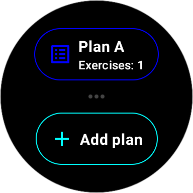
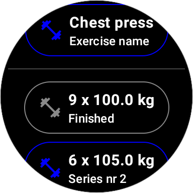

Workout App for Wear OS Smartwatch
===================================
A workout app for the Wear OS smartwatch developed using the Jetpack Compose framework based on
the Google Compose for Wear OS Advanced Sample project, which allows the user to create workout
plans, add exercises to them along with series with number of repetitions and weight, and monitor
workout progress.

Screenshots
-----------

