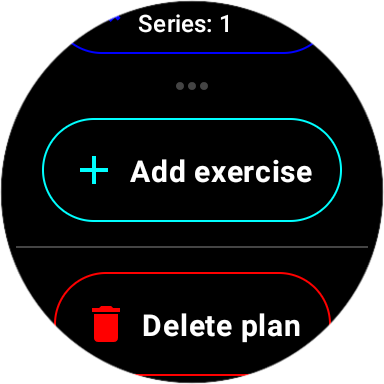
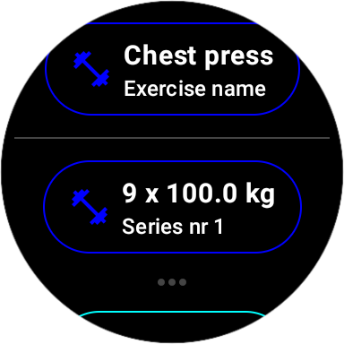

Workout App for Wear OS Smartwatch
===================================
A workout app for the Wear OS smartwatch developed using the Jetpack Compose framework, which
allows the user to create workout plans, add exercises to them along with series with number
of repetitions and weight, and monitor workout progress.

Screenshots
-----------

Landing screen:

Workout plan screen:

Exercise screen:

Exercise set screen:

Repetition screen:

Weight screen:

Workout in progress screen:

Exercise in progress screen:

Exercise set in progress screen:

